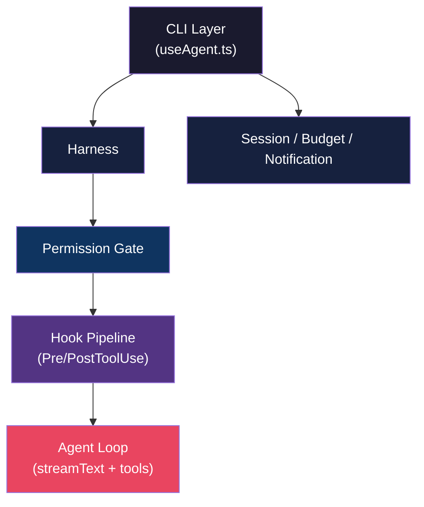
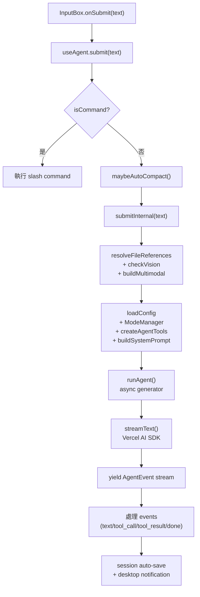
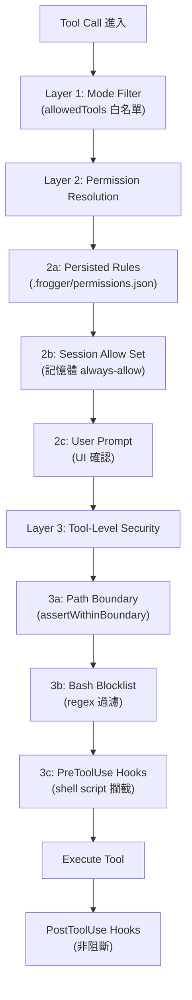
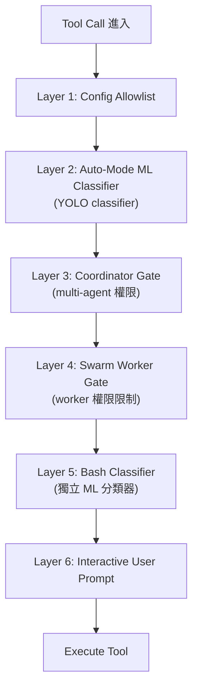

# Frogger Harness 架構分析

> 分析日期：2026-04-01 | 對標版本：Claude Code v2.1.88（source map 洩漏版）

使用者在開發 Frogger 時沒有刻意設計 harness 架構，但實際上已經有一套完整的控制層。
本文件系統化分析現有的 harness，對標 Claude Code，找出已有的、缺少的、和可以改進的。

---

## 什麼是 Harness？

Harness = 包在 agent loop 外面的「控制基礎設施」，決定：
- Agent **能做什麼**（Permission Gate）
- Agent **怎麼執行**（Execution Pipeline）
- **出錯怎麼辦**（Error Boundary）
- **資源怎麼管**（Resource Management）
- **看得到什麼**（Observability）

---

## Layer 1: Execution Pipeline（已有 ✅）

### 請求生命週期

**對比 Claude Code**：流程結構相似，但 Claude Code 的 `QueryEngine` 是 class（有狀態），Frogger 的 `submitInternal` 是 closure（無狀態，每次重建）。

### 現有狀態：完整 ✅
- 檔案引用解析、vision 檢查、multimodal 支援
- Mode-aware tool filtering + system prompt injection
- Event-driven streaming（async generator pattern）
- Auto-execute（plan → agent）
- LLM-driven mode switch（switch-mode tool）

---

## Layer 2: Safety Gates（已有 ✅，但層數少）

### Frogger 的 3 層防護

### Claude Code 的 6 層防護

### 差距分析

| Gate | Frogger | Claude Code | 差距 |
|------|---------|-------------|------|
| Mode Filter | ✅ allowedTools | ✅ | 持平 |
| Rule-Based Permission | ✅ glob pattern matching | ✅ | 持平 |
| ML Classifier | ❌ | ✅ YOLO classifier | **缺少** |
| Multi-Agent Permission | ❌ | ✅ Coordinator/Swarm gate | N/A（無 multi-agent） |
| Bash Security | ✅ regex blocklist | ✅ 17 files + ML classifier | **較弱** |
| Path Boundary | ✅ assertWithinBoundary | ✅ | 持平 |
| Hook System | ✅ Pre/PostToolUse | ✅ | 持平 |
| Project Hook Confirmation | ✅ SHA-256 hash | ✅ | 持平 |

**結論**：Frogger 的 rule-based 防護完整，但缺少 ML-based 的智慧判斷層。對企業客戶來說，rule-based 其實更可預測、更好審計。

---

## Layer 3: Error Boundaries（已有 ✅）

### 四層錯誤邊界

```mermaid
graph TD
    E1["Layer 1: Agent Loop<br>(agent.ts)"]
    E1 --> E1a["hasYielded flag<br>已 yield 就不重試"]
    E1 --> E1b["isRetryableError()<br>429/500/502/503"]
    E1 --> E1c["Exponential backoff<br>+ jitter"]
    E1 --> E1d["maxRetries = 3"]

    E2["Layer 2: Tool Execute<br>(registry.ts)"]
    E2 --> E2a["onBeforeExecute throws<br>→ error string"]
    E2 --> E2b["origExecute fails<br>→ error string"]
    E2 --> E2c["onAfterExecute throws<br>→ logger.warn"]

    E3["Layer 3: CLI<br>(useAgent.ts)"]
    E3 --> E3a["Mode-switch AbortError<br>→ 靜默"]
    E3 --> E3b["Other errors<br>→ 顯示給使用者"]

    E4["Layer 4: Cleanup<br>(finally block)"]
    E4 --> E4a["resolve pending permission<br>with 'deny'"]
    E4 --> E4b["clear abortRef"]
    E4 --> E4c["closeAll MCP"]
    E4 --> E4d["reset streaming state"]
```

### 對比 Claude Code

| 機制 | Frogger | Claude Code |
|------|---------|-------------|
| Retry with backoff | ✅ | ✅ |
| hasYielded guard | ✅ | ✅ |
| Tool never throws | ✅ | ✅ |
| Pending promise cleanup | ✅ | ✅ |
| Graceful abort handling | ✅ | ✅ |

**結論**：Error boundary 設計已經很成熟，跟 Claude Code 持平。

---

## Layer 4: Resource Management（已有 ✅，部分可強化）

### 現有資源管理

| 資源 | 管理方式 | 狀態 |
|------|---------|------|
| **Token Budget** | ContextBudgetTracker，90% 觸發壓縮 | ✅ |
| **Context Compaction** | LLM summarize（保留 first + last 4） | ✅ 但只有 1 種策略 |
| **Hard Limit** | 超過 context window 90% 強制截斷 | ✅ |
| **Session** | Auto-save after done event | ✅ |
| **AbortController** | Per-submission lifecycle | ✅ |
| **MCP Connections** | useEffect cleanup on unmount | ✅ |

### Claude Code 多了什麼

| 資源 | Claude Code | Frogger 缺少 |
|------|-------------|-------------|
| **Compaction 策略** | 4 種（standard/reactive/micro/snip） | 只有 1 種 |
| **Cache Boundary** | SYSTEM_PROMPT_DYNAMIC_BOUNDARY 精細分割 | 只有 ephemeral 標記 |
| **File State Cache** | QueryEngine 內建檔案狀態快取 | 無 |
| **Memory Consolidation** | KAIROS autoDream（實驗性） | 無 |

---

## Layer 5: Observability（已有 ✅，可擴展）

### 現有可觀測性

| 維度 | 實作 | 品質 |
|------|------|------|
| **Logging** | logger.debug/info/warn/error → console.error | ✅ 基礎 |
| **Token Tracking** | 6 維度（prompt/completion/reasoning/cacheRead/cacheCreation/total） | ✅ 完整 |
| **Cost Calculation** | calculateCost() 含 cache pricing | ✅ 完整 |
| **Live Streaming Stats** | StreamingStats component | ✅ |
| **Context Budget Display** | ContextUsage component | ✅ |
| **Desktop Notification** | BEL + node-notifier fallback | ✅ |
| **Event Stream** | 7 event types 完整覆蓋 | ✅ |

### 企業場景缺少的

| 維度 | 需求 | 目前狀態 |
|------|------|---------|
| **Audit Log** | 誰在何時用了什麼 tool，改了什麼檔案 | ❌ 無 |
| **Team Dashboard** | 團隊級 token 消耗、成本報表 | ❌ 無 |
| **Structured Logging** | JSON format → 可接 ELK/Datadog | ❌ 目前是 plain text |
| **Trace ID** | 跨 tool call 的關聯追蹤 | ❌ 無 |

---

## 總結：Harness 成熟度評分

| Layer | Frogger | Claude Code | 評分 |
|-------|---------|-------------|------|
| **Execution Pipeline** | 完整 | 完整 | 4/5 |
| **Safety Gates** | 3 層 rule-based | 6 層 rule + ML | 3/5 |
| **Error Boundaries** | 4 層完整 | 4 層完整 | 4/5 |
| **Resource Management** | 基礎完整 | 精細多策略 | 3/5 |
| **Observability** | 開發者級 | 企業級 | 3/5 |

**整體：Frogger 的 harness 已經有 80% 的骨架，缺的是企業級的深度**（ML classifier、多策略壓縮、審計日誌、structured logging）。

---

## 企業化升級建議（按優先級）

### P0: 必須有才能賣給企業
1. **Audit Log** — 結構化記錄每次 tool 執行（who/when/what/result）
2. **Structured Logging** — JSON log format，支援 log aggregation

### P1: 差異化競爭力
3. **並行 Tool 執行** — 讀取類 tool 並行化（concurrent batch）
4. **多策略 Context Compaction** — 加入 micro/snip compact
5. **RAG Tool** — 企業文件庫查詢（核心差異化）

### P2: 錦上添花
6. **Prompt Cache 優化** — 分割 static/dynamic boundary
7. **File State Cache** — 減少重複讀檔
8. **ML Permission Classifier** — 用 LLM 判斷 tool call 安全性

---

## 關鍵檔案對照

| Harness 層 | 檔案路徑 |
|-----------|---------|
| Execution Pipeline | `packages/cli/src/hooks/useAgent.ts` |
| Agent Loop | `packages/core/src/agent/agent.ts` |
| Tool Registry + Permission | `packages/core/src/tools/registry.ts` |
| Permission Rules | `packages/core/src/permission/rules.ts` |
| Path Security | `packages/core/src/tools/security.ts` |
| Bash Blocklist | `packages/core/src/tools/bash.ts` |
| Hook Executor | `packages/core/src/hooks/executor.ts` |
| Retry Logic | `packages/core/src/agent/retry.ts` |
| Context Budget | `packages/core/src/agent/context-budget.ts` |
| Tool Factory | `packages/core/src/agent/agent-tools.ts` |
| System Prompt Builder | `packages/core/src/llm/system-prompt.ts` |
| Logger | `packages/core/src/utils/logger.ts` |
| Notifications | `packages/cli/src/utils/notify.ts` |
